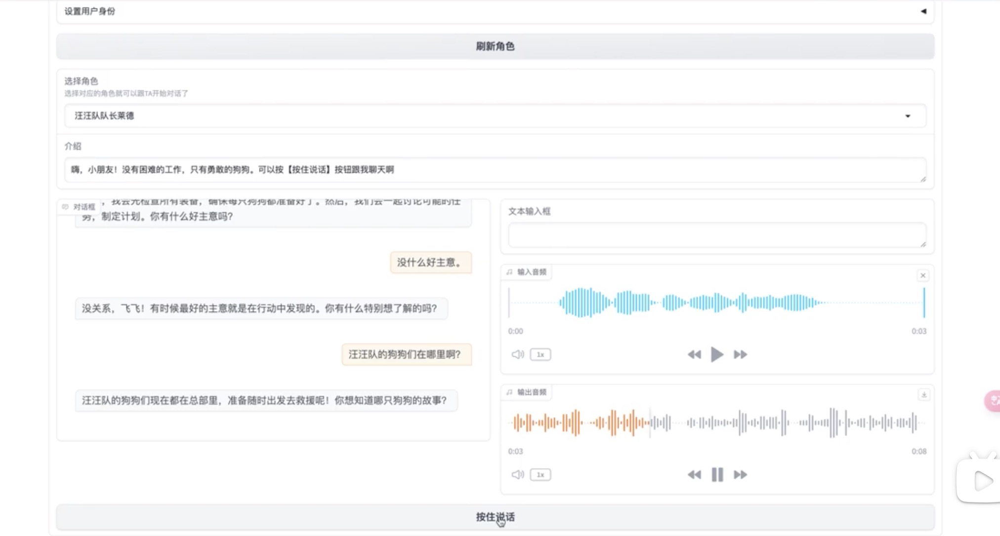

# children_ai_assistant

## Introduction

This is the spike for Children AI Assistant which can tech 3 years old children some knowledge and answer the question from children via voice conversation.

I am used doubao LLM API, volcengine ASR and TTS, Gradio for conversation UI.

And now I have implemented the audio to audio conversation via Gradio.

Besides, I use the python API framework fastapi to build a simple API server which provide a simple conversation page and can send and reply message via websocket.

## Gradio voice to voice demo recording

## AI Voice Conversations with a Three-Year-Old: A User's Experience
