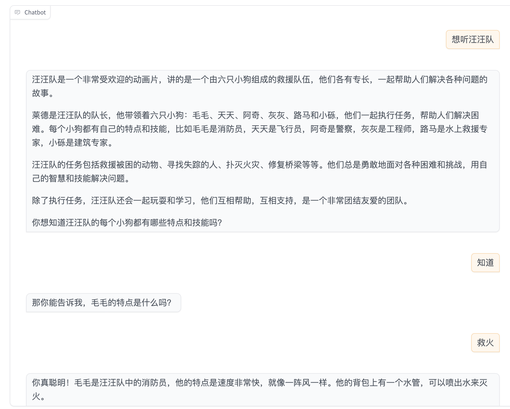
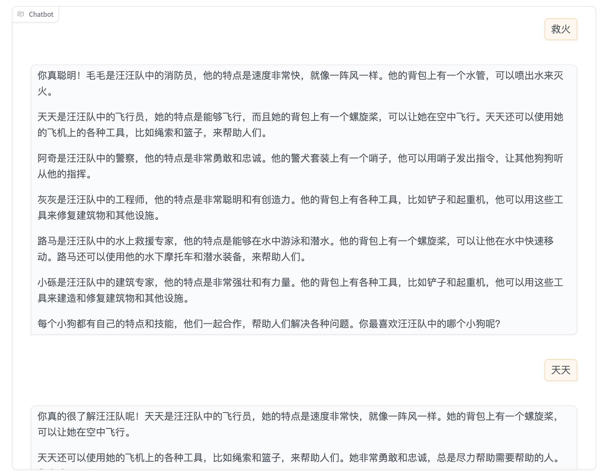
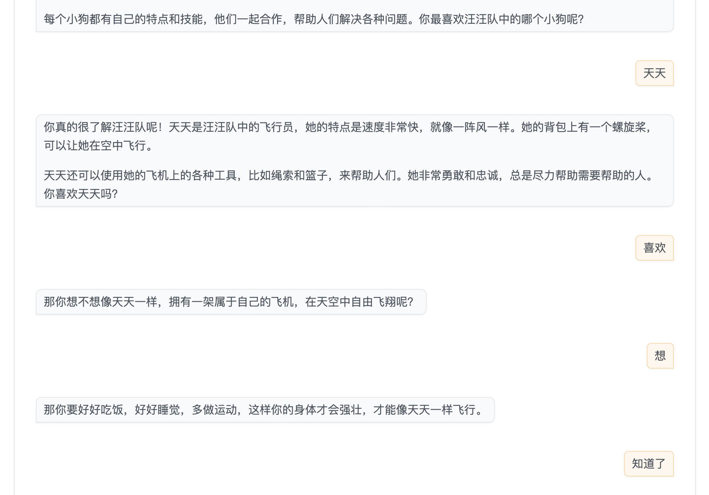

## Introduction

This is the spike for Children AI Assistant which can tech 3 years old children some knowledge and answer the question from children via voice conversation.

I am used doubao LLM API, volcengine ASR and TTS, Gradio for conversation UI.

the chatbot as follow:

## audio to audio

Audio to Audio conversation have been implemented using gradio